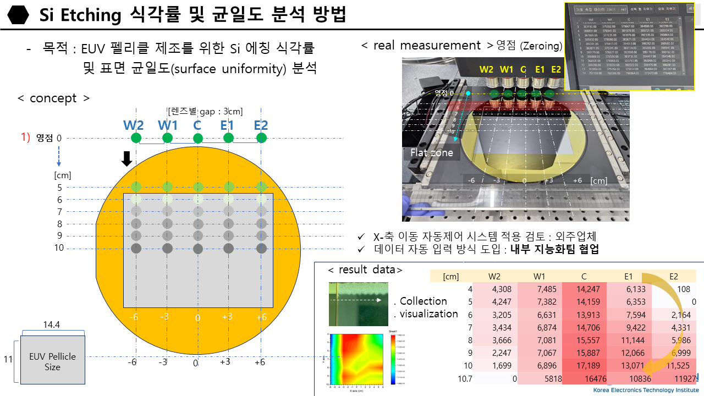

# Measurement of Wet Etching Rate
This program was developed based on our dear operator Dr. J. Yoon's requests 😊 and aims to streamline the measurement of the wet etching rate and surface uniformity of Si samples. 

 

 
&lt;PROJECT OVERVIEW&gt;

 

Fig. 1. This program aims to effectively measure the wet etching rate and surface uniformity of Si samples. Courtesy of Dr. Yoon.
 
 

 
&lt;BRIEF INTRODUCTION&gt;

 
This program operates on top of the etch rate measurement application and is designed to position itself over the area where the measurement data are logged as in Fig. 1. It first saves the area as an image file (.PNG) as a backup, read the figures with the optical character recognition engine Tesseract, and save them in an Excel file (.CSV). 

 

 

Fig. 2. Example of program execution screen, situated over the area where measurement data are logged. 
   The UI in the figure is outdated and the latest version taks the form in the following firues.
 
 

  This program consists of two windows–measurement window and visualization window. While the buttons in the measurement window are designed to help arrange data in an Excel file or to take a screenshot of the area in cosideration, the visualization window allows users to easily plot the data, identify faulty points, and estimate the degree of surface flatness. 

 
<table>
  <tr>
    <td></td>
    <td></td>
  </tr>
</table>

Fig. 3. Measurement window (left) and visualization window (right)
 
 
* Detailed information on each button is available in the user guide.
