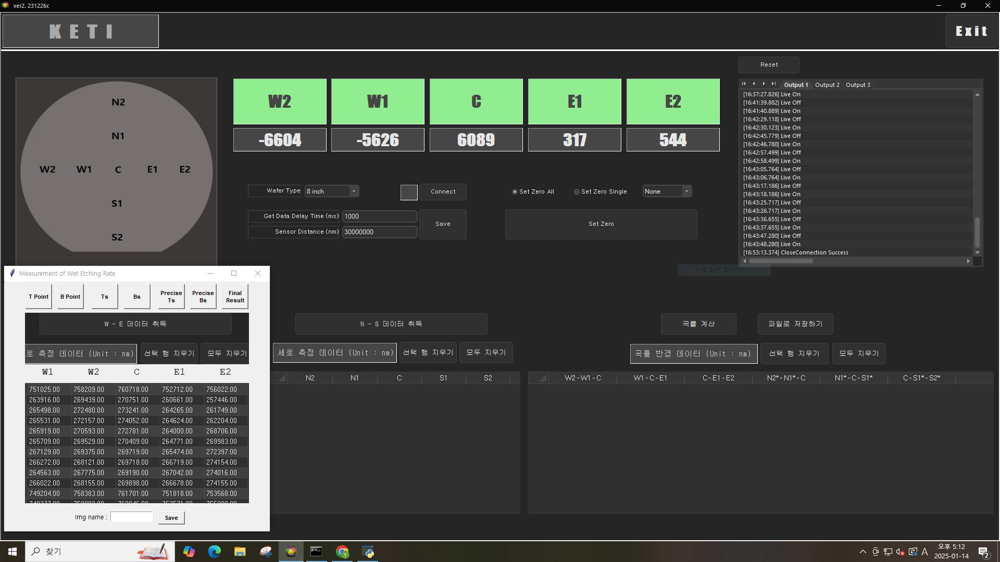
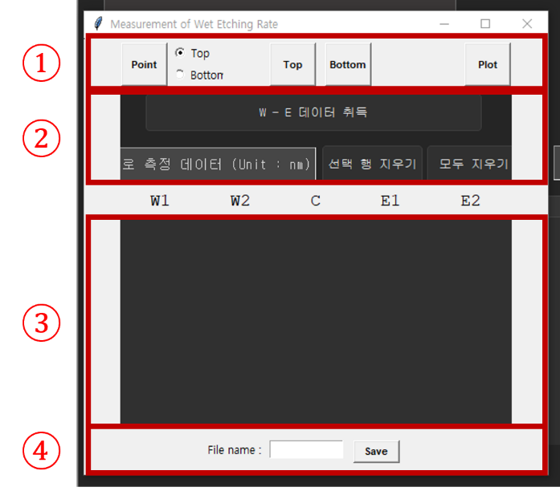
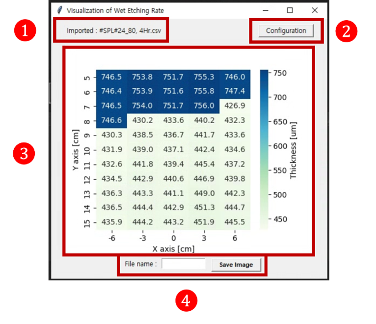

# Measurement of Wet Etching Rate
This program was developed based on our dear operator Mr. J. Yoon's requests and aims to streamline the measurement of the wet etching rate of semiconductor samples. 

**&lt;BREIF INTRODUCTION&gt;**
 

 
This program operates on top of the etch rate measurement application and is designed to position itself over the area where the measurement data are logged as in Fig. 1. It first saves the area as an image file (.PNG) as a backup, read the figures with the optical character recognition engine Tesseract, and save them in an Excel file (.CSV). 

 

 

Fig. 1. Example of program execution screen, situated over the area where measurement data are logged. 
   The UI in the figure is outdated and the latest version taks the form in the following firues.
 
 

  This program consists of two windows–measurement window and visualization window. First, the buttons on the measurement window excluding the plot button determine how to organize data. These functions are customized according to Mr. Yoon's needs.

 
<table>
  <tr>
    <td></td>
    <td></td>
  </tr>
</table>
 
For detailed information, refer to the user manual. 
